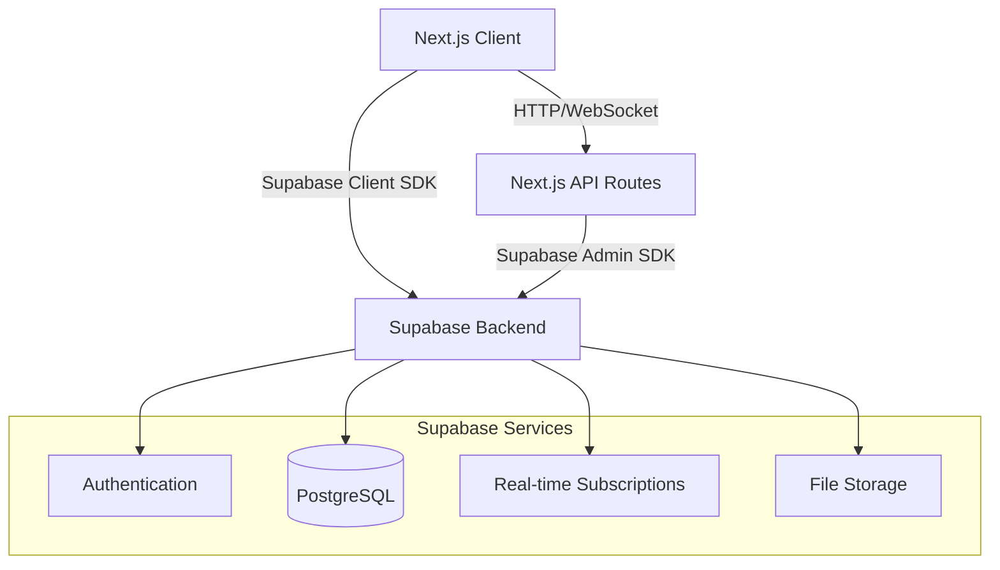

# Design Document

## Overview

The TUM Community Platform is a Next.js 14+ web application using the App Router, styled with Tailwind CSS and shadcn/ui components in a dark theme with violet accent colors. The backend leverages Supabase for authentication, real-time subscriptions, and database operations. The platform consists of four main modules: Authentication & Authorization, Forum System, Channels System, Events System, and Wiki System.

### Tech Stack

- **Frontend**: Next.js 14+ (App Router), React 18+, TypeScript
- **Styling**: Tailwind CSS, shadcn/ui components
- **Theme**: Dark mode with violet accent colors (primary: violet-600, secondary: violet-400)
- **Backend**: Supabase (PostgreSQL database, Authentication, Real-time subscriptions, Storage)
- **Additional Libraries**:
  - QR Code generation: `qrcode` or `react-qr-code`
  - Rich text editor: `tiptap` or `lexical`
  - Date handling: `date-fns`
  - Form validation: `zod` with `react-hook-form`
  - Calendar component: `react-big-calendar` or `@fullcalendar/react`

## Architecture

### High-Level Architecture



### Application Structure

```
src/
├── app/
│   ├── (auth)/
│   │   ├── login/
│   │   ├── register/
│   │   └── verify-email/
│   ├── (guest)/
│   │   └── wiki/
│   ├── (authenticated)/
│   │   ├── forums/
│   │   ├── channels/
│   │   ├── events/
│   │   ├── calendar/
│   │   └── profile/
│   ├── (admin)/
│   │   └── dashboard/
│   └── api/
├── components/
│   ├── ui/ (shadcn components)
│   ├── forums/
│   ├── channels/
│   ├── events/
│   ├── calendar/
│   └── wiki/
├── lib/
│   ├── supabase/
│   ├── hooks/
│   ├── utils/
│   └── validations/
└── types/
```

## Components and Interfaces

### 1. Authentication System

**Components:**
- `AuthProvider`: Context provider for authentication state
- `LoginForm`: Email/password login with TUM domain validation
- `RegisterForm`: Registration with email verification
- `GuestAccessButton`: "Continue as Guest" option
- `ProtectedRoute`: HOC for route protection

**Key Functions:**
```typescript
// Email validation
function validateTUMEmail(email: string): boolean {
  return email.endsWith('@tum.de') || email.endsWith('@mytum.de');
}

// Supabase auth integration
async function signUp(email: string, password: string): Promise<AuthResponse>
async function signIn(email: string, password: string): Promise<AuthResponse>
async function signOut(): Promise<void>
```

### 2. Forum System

**Database Schema:**
```typescript
interface Subforum {
  id: string;
  name: string;
  description: string;
  creator_id: string;
  created_at: timestamp;
  member_count: number;
}

interface Post {
  id: string;
  subforum_id: string;
  author_id: string;
  title: string;
  content: string;
  is_anonymous: boolean;
  vote_count: number;
  created_at: timestamp;
  updated_at: timestamp;
}

interface Comment {
  id: string;
  post_id: string;
  author_id: string;
  content: string;
  is_anonymous: boolean;
  created_at: timestamp;
}

interface Vote {
  id: string;
  post_id: string;
  user_id: string;
  vote_type: 'upvote' | 'downvote';
  created_at: timestamp;
}

interface SubforumMembership {
  subforum_id: string;
  user_id: string;
  joined_at: timestamp;
}
```

**Components:**
- `SubforumList`: Display all subforums with search/filter
- `SubforumCard`: Individual subforum preview
- `CreateSubforumDialog`: Modal for creating new subforums
- `PostList`: Display posts with sorting options
- `PostCard`: Individual post with vote buttons
- `CreatePostForm`: Form with anonymous toggle
- `CommentThread`: Nested comment display
- `VoteButtons`: Upvote/downvote UI

### 3. Channels System

**Database Schema:**
```typescript
interface Channel {
  id: string;
  name: string;
  description: string;
  created_by: string; // admin user_id
  created_at: timestamp;
  member_count: number;
}

interface ChannelMessage {
  id: string;
  channel_id: string;
  author_id: string;
  content: string;
  created_at: timestamp;
}

interface ChannelMembership {
  channel_id: string;
  user_id: string;
  joined_at: timestamp;
}
```

**Components:**
- `ChannelList`: Display all channels with search
- `ChannelCard`: Individual channel preview
- `CreateChannelDialog`: Admin-only channel creation
- `ChannelView`: Real-time message display
- `MessageInput`: Send message form
- `MessageList`: Scrollable message history

**Real-time Integration:**
```typescript
// Subscribe to new messages
supabase
  .channel(`channel:${channelId}`)
  .on('postgres_changes', 
    { event: 'INSERT', schema: 'public', table: 'channel_messages' },
    handleNewMessage
  )
  .subscribe();
```

### 4. Events System

**Database Schema:**
```typescript
interface Event {
  id: string;
  title: string;
  description: string;
  event_type: 'tum_native' | 'external';
  date: timestamp;
  time: string;
  location: string;
  external_link?: string;
  creator_id: string;
  created_at: timestamp;
  max_attendees?: number;
}

interface EventRegistration {
  id: string;
  event_id: string;
  user_id: string;
  qr_code?: string; // For TUM native events
  registered_at: timestamp;
}

interface UserPermissions {
  user_id: string;
  can_create_events: boolean;
  is_admin: boolean;
}
```

**Components:**
- `EventList`: Display events with filters
- `EventCard`: Individual event preview
- `CreateEventDialog`: Event creation form (permission-gated)
- `EventDetails`: Full event information
- `RegistrationButton`: Register/unregister action
- `QRCodeDisplay`: Show QR ticket for registered events
- `EventFilters`: Date range and type filters

**QR Code Generation:**
```typescript
async function generateQRCode(eventId: string, userId: string): Promise<string> {
  const data = JSON.stringify({ eventId, userId, timestamp: Date.now() });
  return await QRCode.toDataURL(data);
}
```

### 5. Wiki System

**Database Schema:**
```typescript
interface WikiArticle {
  id: string;
  title: string;
  content: string; // Rich text/markdown
  category: string;
  created_by: string; // admin user_id
  created_at: timestamp;
  updated_at: timestamp;
  is_published: boolean;
}

interface WikiVersion {
  id: string;
  article_id: string;
  content: string;
  version_number: number;
  created_at: timestamp;
  created_by: string;
}
```

**Components:**
- `WikiHome`: Landing page with categories
- `WikiArticleList`: Articles by category
- `WikiArticle`: Article display with rich text
- `WikiEditor`: Admin article creation/editing
- `WikiSearch`: Search across articles
- `VersionHistory`: View article versions

### 6. Search & Filter System

**Implementation:**
```typescript
// Full-text search using Supabase
async function searchSubforums(query: string): Promise<Subforum[]> {
  const { data } = await supabase
    .from('subforums')
    .select('*')
    .textSearch('name_description', query);
  return data;
}

// Event filtering
async function filterEvents(
  dateRange?: { start: Date; end: Date },
  eventType?: 'tum_native' | 'external'
): Promise<Event[]> {
  let query = supabase.from('events').select('*');
  
  if (dateRange) {
    query = query.gte('date', dateRange.start).lte('date', dateRange.end);
  }
  
  if (eventType) {
    query = query.eq('event_type', eventType);
  }
  
  const { data } = await query;
  return data;
}
```

### 7. Calendar System

**Database Schema:**
```typescript
interface PersonalCalendarEvent {
  id: string;
  user_id: string;
  title: string;
  description?: string;
  date: timestamp;
  time: string;
  color: string; // Hex color for visual distinction
  created_at: timestamp;
  updated_at: timestamp;
}

// Note: Subscribed events come from EventRegistration table
```

**Components:**
- `CalendarView`: Main calendar display with month/week/day views
- `CalendarEventCard`: Display individual calendar events
- `CreatePersonalEventDialog`: Form to create personal calendar events
- `EditPersonalEventDialog`: Form to edit personal calendar events
- `CalendarFilters`: Toggle between showing all events, only subscribed, or only personal
- `EventTypeIndicator`: Visual distinction between subscribed and personal events

**Calendar Integration:**
```typescript
// Fetch combined calendar data
async function getCalendarEvents(userId: string): Promise<CalendarEvent[]> {
  // Get subscribed events from event registrations
  const { data: subscribedEvents } = await supabase
    .from('event_registrations')
    .select('*, events(*)')
    .eq('user_id', userId);
  
  // Get personal calendar events
  const { data: personalEvents } = await supabase
    .from('personal_calendar_events')
    .select('*')
    .eq('user_id', userId);
  
  // Combine and format for calendar display
  return [...subscribedEvents, ...personalEvents].map(formatForCalendar);
}
```

### 8. Admin & Moderation System

**Database Schema:**
```typescript
interface ModerationLog {
  id: string;
  admin_id: string;
  action_type: 'delete_post' | 'delete_comment' | 'grant_permission' | 'revoke_permission';
  target_id: string;
  target_type: string;
  reason?: string;
  created_at: timestamp;
}
```

**Components:**
- `AdminDashboard`: Overview of moderation actions
- `ModerationPanel`: View and manage content
- `PermissionManager`: Grant/revoke event creator permissions
- `ModerationLogs`: Audit trail display

## Data Models

### User Profile Extension

```typescript
interface UserProfile {
  id: string; // matches auth.users.id
  email: string;
  display_name?: string;
  avatar_url?: string;
  is_admin: boolean;
  can_create_events: boolean;
  created_at: timestamp;
}
```

### Row Level Security (RLS) Policies

Key Supabase RLS policies:

1. **Posts**: Users can read all posts, create their own, update/delete only their own
2. **Anonymous Posts**: Hide author_id from non-admin users
3. **Channels**: Only admins can create, all authenticated users can read
4. **Events**: Only users with `can_create_events` can create
5. **Wiki**: All users (including guests) can read, only admins can write
6. **Moderation Logs**: Only admins can read/write


## Correctness Properties

*A property is a characteristic or behavior that should hold true across all valid executions of a system—essentially, a formal statement about what the system should do. Properties serve as the bridge between human-readable specifications and machine-verifiable correctness guarantees.*

### Authentication & Authorization Properties

**Property 1: TUM email validation**
*For any* email address, the registration system should accept it if and only if it ends with @tum.de or @mytum.de
**Validates: Requirements 1.1, 1.5**

**Property 2: Unverified user access restriction**
*For any* user with an unverified email and any protected route, access should be denied and the user should be prompted for verification
**Validates: Requirements 1.4**

**Property 3: Guest access restriction**
*For any* guest user and any protected section (forums, channels, events), access should be denied and authentication should be required
**Validates: Requirements 10.5**

### Forum System Properties

**Property 4: Subforum creation completeness**
*For any* subforum creation request with valid data, the stored subforum should contain all required fields: unique ID, name, description, and creator information
**Validates: Requirements 2.1**

**Property 5: Subforum display completeness**
*For any* subforum in the system, when displayed in the forum list, it should show name, description, and member count
**Validates: Requirements 2.2**

**Property 6: Subforum membership addition**
*For any* student and subforum, when the student joins the subforum, they should appear in the subforum's membership list
**Validates: Requirements 2.3**

**Property 7: Post association integrity**
*For any* post created in a subforum, the post should be associated with both the subforum ID and the author ID
**Validates: Requirements 2.4**

**Property 8: Post ordering consistency**
*For any* subforum with multiple posts, the posts should be ordered by either creation time or vote count consistently
**Validates: Requirements 2.5, 4.5**

**Property 9: Anonymous post author hiding**
*For any* anonymous post and any non-admin user, the author's identity should not be visible in the displayed post
**Validates: Requirements 3.2**

**Property 10: Anonymous post backend integrity**
*For any* anonymous post, the author_id should be stored in the database even when is_anonymous is true
**Validates: Requirements 3.3**

**Property 11: Author display based on anonymity**
*For any* post, if is_anonymous is true, display a generic identifier; if false, display the author's name and profile
**Validates: Requirements 3.4, 3.5**

**Property 12: Upvote increments count**
*For any* post and user who hasn't voted, upvoting should increase the vote count by exactly one
**Validates: Requirements 4.1**

**Property 13: Downvote decrements count**
*For any* post and user who hasn't voted, downvoting should decrease the vote count by exactly one
**Validates: Requirements 4.2**

**Property 14: Vote change replaces previous vote**
*For any* post and user who has already voted, voting again should remove the previous vote and apply the new vote, resulting in a net change of at most 2
**Validates: Requirements 4.3**

**Property 15: Comment association**
*For any* comment created on a post, the comment should be associated with the post ID and appear in that post's comment thread
**Validates: Requirements 4.4**

### Channel System Properties

**Property 16: Channel creation completeness**
*For any* channel creation request by an admin with valid data, the stored channel should contain name, description, and official status
**Validates: Requirements 5.1**

**Property 17: Channel creation authorization**
*For any* non-admin user attempting to create a channel, the request should be denied with an error message
**Validates: Requirements 5.2**

**Property 18: Channel list completeness**
*For any* set of channels in the system, the channels section should display all of them
**Validates: Requirements 5.3**

**Property 19: Channel membership addition**
*For any* student and channel, when the student joins the channel, they should appear in the channel's membership list
**Validates: Requirements 5.4**

**Property 20: Channel membership removal**
*For any* student and channel they've joined, when the student leaves, they should be removed from the channel's membership list
**Validates: Requirements 5.5**

**Property 21: Message creation completeness**
*For any* message sent to a channel, the stored message should contain timestamp, author ID, and channel association
**Validates: Requirements 6.1**

**Property 22: Message chronological ordering**
*For any* channel with multiple messages, the messages should be displayed in chronological order by timestamp
**Validates: Requirements 6.2**

**Property 23: Message visibility to members**
*For any* message sent to a channel and any member of that channel, the message should be visible to the member
**Validates: Requirements 6.3**

**Property 24: Message access restriction**
*For any* non-member user and channel, attempting to view messages should be denied with a prompt to join
**Validates: Requirements 6.4**

### Event System Properties

**Property 25: Event creation completeness**
*For any* event creation request with valid data, the stored event should contain title, description, date, time, location, and event type
**Validates: Requirements 7.1**

**Property 26: TUM native event QR generation**
*For any* TUM native event and registered student, a unique QR code should be generated for that student
**Validates: Requirements 7.2, 8.2**

**Property 27: External event link storage**
*For any* external event, the system should allow and store an external registration link
**Validates: Requirements 7.3**

**Property 28: Event creation authorization**
*For any* user without event creator permissions attempting to create an event, the request should be denied with an error message
**Validates: Requirements 7.4**

**Property 29: Published event visibility**
*For any* published event, it should appear in the events section visible to all students
**Validates: Requirements 7.5, 8.1**

**Property 30: QR code display for registered events**
*For any* TUM native event a student has registered for, the student should be able to view their QR code ticket
**Validates: Requirements 8.4**

**Property 31: External event link provision**
*For any* external event a student registers for, the external registration link should be provided to the student
**Validates: Requirements 8.3**

**Property 32: Event unregistration cleanup**
*For any* student registered for an event, unregistering should remove them from the attendee list and invalidate any generated tickets
**Validates: Requirements 8.5**

### Search & Filter Properties

**Property 33: Subforum search accuracy**
*For any* search query in the forum section, all returned subforums should match the query in either name or description
**Validates: Requirements 9.1**

**Property 34: Channel search accuracy**
*For any* search query in the channels section, all returned channels should match the query in either name or description
**Validates: Requirements 9.2**

**Property 35: Event date range filtering**
*For any* date range filter applied to events, all returned events should have dates within the specified range
**Validates: Requirements 9.3**

**Property 36: Event type filtering**
*For any* event type filter (TUM native or external), all returned events should match the selected type
**Validates: Requirements 9.4**

**Property 37: Multiple filter conjunction**
*For any* combination of filters applied, all returned results should satisfy all filter criteria (AND logic)
**Validates: Requirements 9.5**

### Wiki System Properties

**Property 38: Guest wiki access**
*For any* guest user, they should be able to access the wiki section without authentication
**Validates: Requirements 10.2**

**Property 39: Wiki article creation completeness**
*For any* wiki article created by an admin, the stored article should contain title, content, category, and last updated timestamp
**Validates: Requirements 11.1**

**Property 40: Wiki article update tracking**
*For any* wiki article that is edited, the content and timestamp should be updated to reflect the changes
**Validates: Requirements 11.2**

**Property 41: Wiki article category organization**
*For any* set of published wiki articles, they should be displayed organized by category
**Validates: Requirements 11.3**

**Property 42: Wiki article deletion**
*For any* wiki article deleted by an admin, it should not appear in the public wiki view
**Validates: Requirements 11.4**

**Property 43: Wiki version history maintenance**
*For any* wiki article update, a new version entry should be created in the version history
**Validates: Requirements 11.5**

### Calendar System Properties

**Property 44: Subscribed events in calendar**
*For any* student and event they have registered for, the event should appear in their calendar view
**Validates: Requirements 12.1**

**Property 45: Personal event creation completeness**
*For any* personal calendar event created by a student, the stored event should contain title, description, date, time, and color coding
**Validates: Requirements 12.2**

**Property 46: Calendar displays both event types**
*For any* student's calendar view, it should display both subscribed events and personal calendar events
**Validates: Requirements 12.3**

**Property 47: Personal event update**
*For any* personal calendar event that is edited, the updated details should be persisted and reflected in the calendar
**Validates: Requirements 12.4**

**Property 48: Personal event deletion**
*For any* personal calendar event that is deleted, it should no longer appear in the calendar view
**Validates: Requirements 12.5**

**Property 49: Unsubscribed event removal from calendar**
*For any* event a student unsubscribes from, it should be removed from their calendar view
**Validates: Requirements 12.6**

**Property 50: Event type visual distinction**
*For any* calendar event displayed, subscribed events and personal events should have distinct visual indicators
**Validates: Requirements 12.7**

### Admin & Moderation Properties

**Property 51: Admin anonymous post visibility**
*For any* anonymous post and admin user, the admin should be able to see the true author identity
**Validates: Requirements 13.1**

**Property 52: Admin content deletion**
*For any* post or comment deleted by an admin, it should be removed from public view
**Validates: Requirements 13.2**

**Property 53: Event permission granting**
*For any* student granted event creator permissions by an admin, that student should be able to create events
**Validates: Requirements 13.3**

**Property 54: Event permission revocation**
*For any* student with event creator permissions that are revoked, that student should no longer be able to create events
**Validates: Requirements 13.4**

**Property 55: Moderation log completeness**
*For any* moderation action, a log entry should be created containing the action type, timestamp, and responsible administrator
**Validates: Requirements 13.5**

## Error Handling

### Authentication Errors
- Invalid email format: Display clear error message
- Email already registered: Prompt to login instead
- Verification link expired: Provide option to resend
- Unauthorized access: Redirect to login with return URL

### Forum Errors
- Subforum name conflict: Suggest alternative names
- Post creation failure: Preserve draft content
- Vote operation failure: Revert UI state
- Comment submission failure: Allow retry

### Channel Errors
- Channel creation by non-admin: Clear permission error
- Message send failure: Queue for retry
- Real-time connection loss: Show reconnection status
- Channel not found: Redirect to channel list

### Event Errors
- Event creation by unauthorized user: Permission error
- QR code generation failure: Retry mechanism
- Registration when event is full: Waitlist option
- Past event registration: Prevent with clear message

### Calendar Errors
- Personal event creation failure: Preserve form data for retry
- Date/time validation errors: Clear inline error messages
- Calendar view loading failure: Show cached data if available
- Event synchronization failure: Retry mechanism with user notification
- Conflicting events: Visual warning but allow creation

### Wiki Errors
- Article not found: Suggest related articles
- Edit conflict: Show diff and merge options
- Version restore failure: Maintain current version
- Unauthorized edit attempt: Clear permission error

### General Error Handling Strategy
- Use Zod for input validation with clear error messages
- Implement optimistic UI updates with rollback on failure
- Log errors to Supabase for monitoring
- Display user-friendly error messages with actionable next steps
- Implement retry logic for transient failures

## Testing Strategy

### Unit Testing

Unit tests will verify specific examples and edge cases for individual functions and components:

**Authentication:**
- Test email validation with various formats
- Test TUM domain checking edge cases (@tum.de.fake.com should fail)
- Test guest access button rendering

**Forums:**
- Test vote count calculations with edge cases (multiple votes, vote changes)
- Test anonymous post display logic
- Test post sorting algorithms
- Test empty subforum states

**Channels:**
- Test channel membership operations
- Test message ordering with same timestamps
- Test admin-only channel creation

**Events:**
- Test QR code generation uniqueness
- Test event filtering with edge cases (events on boundary dates)
- Test registration limits

**Calendar:**
- Test personal event CRUD operations
- Test calendar view switching (month/week/day)
- Test event type distinction rendering
- Test subscribed event synchronization

**Wiki:**
- Test article version creation
- Test category organization
- Test guest access permissions

### Property-Based Testing

Property-based tests will verify universal properties across all inputs using **fast-check** (JavaScript/TypeScript property testing library). Each test will run a minimum of 100 iterations.

**Test Configuration:**
```typescript
import fc from 'fast-check';

// Example property test structure
fc.assert(
  fc.property(
    fc.emailAddress(), // arbitrary email generator
    (email) => {
      // Test property
    }
  ),
  { numRuns: 100 }
);
```

**Key Property Tests:**

1. **Email Validation Property** (Property 1)
   - Generate arbitrary email strings
   - Verify only @tum.de and @mytum.de emails are accepted

2. **Vote Consistency Property** (Properties 12-14)
   - Generate arbitrary vote sequences
   - Verify vote counts remain consistent

3. **Search Accuracy Property** (Properties 33-34)
   - Generate arbitrary search queries and data sets
   - Verify all results match the query

4. **Filter Conjunction Property** (Property 37)
   - Generate arbitrary filter combinations
   - Verify AND logic is correctly applied

5. **Membership Operations Property** (Properties 6, 19-20)
   - Generate arbitrary join/leave sequences
   - Verify membership lists remain consistent

6. **Anonymous Post Property** (Properties 9-11)
   - Generate arbitrary posts with random anonymity flags
   - Verify author visibility rules are enforced

7. **Permission Authorization Property** (Properties 17, 28)
   - Generate arbitrary users with different permission levels
   - Verify authorization checks work correctly

8. **Data Completeness Properties** (Properties 4, 16, 21, 25, 39, 45)
   - Generate arbitrary valid input data
   - Verify all required fields are stored

9. **Calendar Integration Property** (Properties 44, 46, 49)
   - Generate arbitrary event registrations and personal events
   - Verify calendar displays correct combined view

Each property-based test must be tagged with a comment explicitly referencing the correctness property:
```typescript
// Feature: tum-community-platform, Property 1: TUM email validation
```

### Integration Testing

- Test complete user flows (registration → verification → forum participation)
- Test real-time channel messaging with multiple clients
- Test event registration and QR code generation end-to-end
- Test calendar synchronization with event registrations
- Test personal calendar event management flow
- Test admin moderation workflows
- Test guest wiki access flow

### End-to-End Testing

- Use Playwright or Cypress for E2E tests
- Test critical user journeys across the application
- Test responsive design on different screen sizes
- Test dark theme rendering
- Test accessibility compliance

