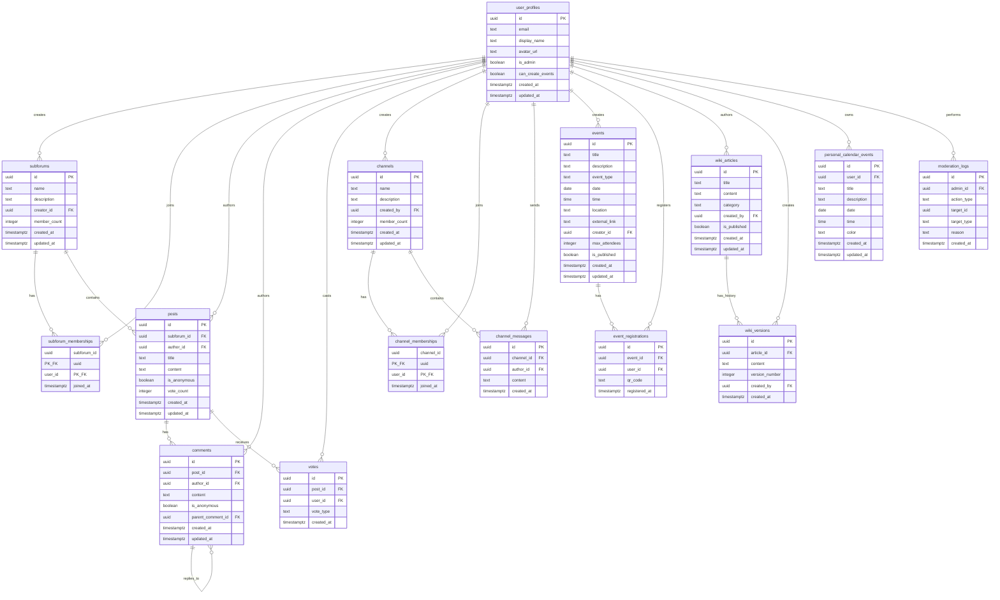

# Database Schema Diagram

## Entity Relationship Overview



## System Architecture by Feature

### Forum System
```
user_profiles
    ↓ creates
subforums ←→ subforum_memberships ← user_profiles
    ↓ contains
posts ←→ votes ← user_profiles
    ↓ has
comments (self-referential for nested comments)
```

### Channels System
```
user_profiles (admin)
    ↓ creates
channels ←→ channel_memberships ← user_profiles
    ↓ contains
channel_messages ← user_profiles
```

### Events System
```
user_profiles (with permission)
    ↓ creates
events ←→ event_registrations ← user_profiles
```

### Wiki System
```
user_profiles (admin)
    ↓ creates/edits
wiki_articles
    ↓ tracks
wiki_versions
```

### Calendar System
```
user_profiles
    ↓ creates
personal_calendar_events
    
user_profiles
    ↓ registers
event_registrations → appears in calendar
```

## Key Relationships

### One-to-Many Relationships
- User → Subforums (creator)
- User → Posts (author)
- User → Comments (author)
- User → Events (creator)
- User → Wiki Articles (author)
- Subforum → Posts
- Post → Comments
- Post → Votes
- Channel → Messages
- Event → Registrations
- Wiki Article → Versions

### Many-to-Many Relationships
- Users ↔ Subforums (via subforum_memberships)
- Users ↔ Channels (via channel_memberships)
- Users ↔ Events (via event_registrations)

### Self-Referential Relationships
- Comments → Comments (parent_comment_id for nested threads)

## Automated Behaviors

### Triggers
1. **Member Count Updates**
   - `subforum_memberships` INSERT/DELETE → updates `subforums.member_count`
   - `channel_memberships` INSERT/DELETE → updates `channels.member_count`

2. **Vote Count Updates**
   - `votes` INSERT/UPDATE/DELETE → updates `posts.vote_count`

3. **Timestamp Updates**
   - Any UPDATE → updates `updated_at` timestamp

4. **Auto-Join Creator**
   - `subforums` INSERT → creates `subforum_memberships` entry

5. **Wiki Versioning**
   - `wiki_articles` INSERT/UPDATE → creates `wiki_versions` entry

## Access Control (RLS)

### Public Access
- ✓ Wiki articles (guest users can read)

### Authenticated Access
- ✓ View all subforums, posts, comments
- ✓ View all channels
- ✓ View published events
- ✓ Create own content
- ✓ Modify own content
- ✓ Delete own content

### Member-Only Access
- ✓ Channel messages (must be channel member)

### Permission-Based Access
- ✓ Create events (requires `can_create_events` flag)
- ✓ Create channels (requires `is_admin` flag)
- ✓ Create/edit wiki (requires `is_admin` flag)

### Admin Access
- ✓ View anonymous post authors
- ✓ Delete any content
- ✓ Manage user permissions
- ✓ View moderation logs

## Indexes for Performance

### Foreign Key Indexes
Every foreign key has an index for efficient joins.

### Composite Indexes
- `(subforum_id, created_at)` - Fast post retrieval by subforum
- `(subforum_id, vote_count)` - Fast popular post retrieval
- `(channel_id, created_at)` - Fast message retrieval
- `(user_id, date)` - Fast calendar event retrieval

### Search Indexes (GIN Trigram)
- `subforums.name` and `subforums.description`
- `channels.name` and `channels.description`
- `wiki_articles.title` and `wiki_articles.content`

### Sorting Indexes
- `created_at DESC` on most tables
- `vote_count DESC` on posts
- `date` on events and calendar entries

## Data Flow Examples

### Creating a Post
1. User creates post → `posts` table
2. Trigger updates `posts.updated_at`
3. RLS checks user is authenticated
4. Post appears in subforum

### Voting on a Post
1. User votes → `votes` table
2. Trigger calculates new vote_count
3. Trigger updates `posts.vote_count`
4. Updated count visible immediately

### Joining a Channel
1. User joins → `channel_memberships` table
2. Trigger increments `channels.member_count`
3. User can now view `channel_messages`
4. RLS grants access to messages

### Registering for Event
1. User registers → `event_registrations` table
2. QR code generated (if TUM native event)
3. Event appears in user's calendar
4. User can view QR code

### Editing Wiki Article
1. Admin edits → `wiki_articles` UPDATE
2. Trigger creates `wiki_versions` entry
3. Version history preserved
4. Updated content visible to all
